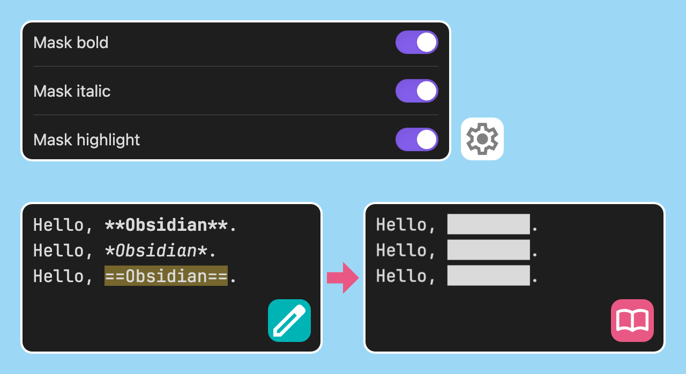
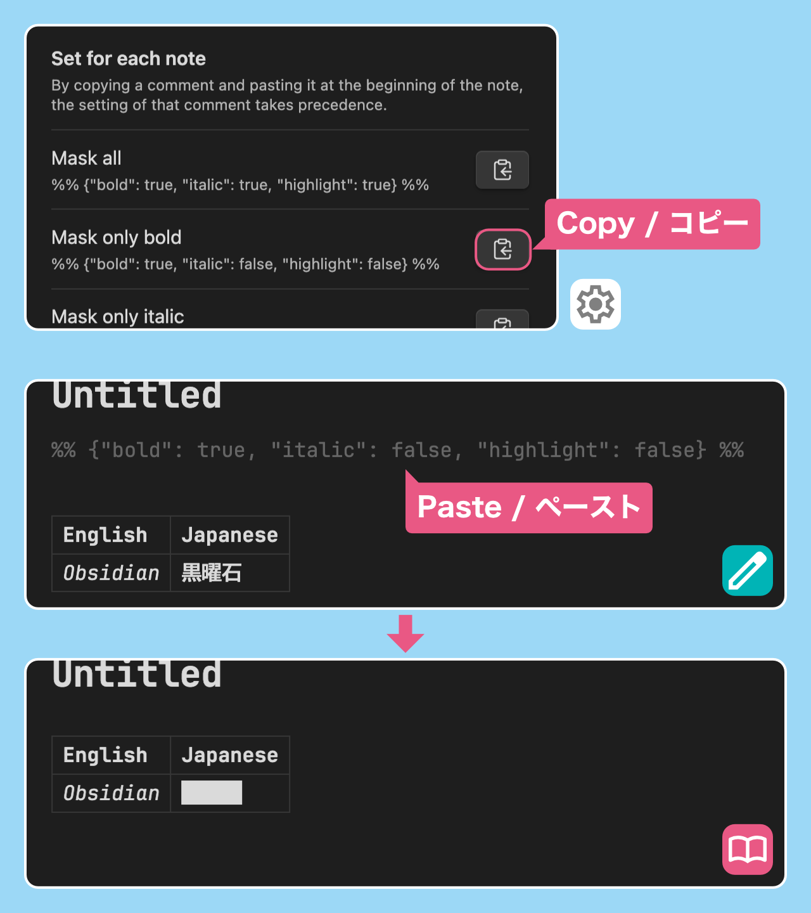
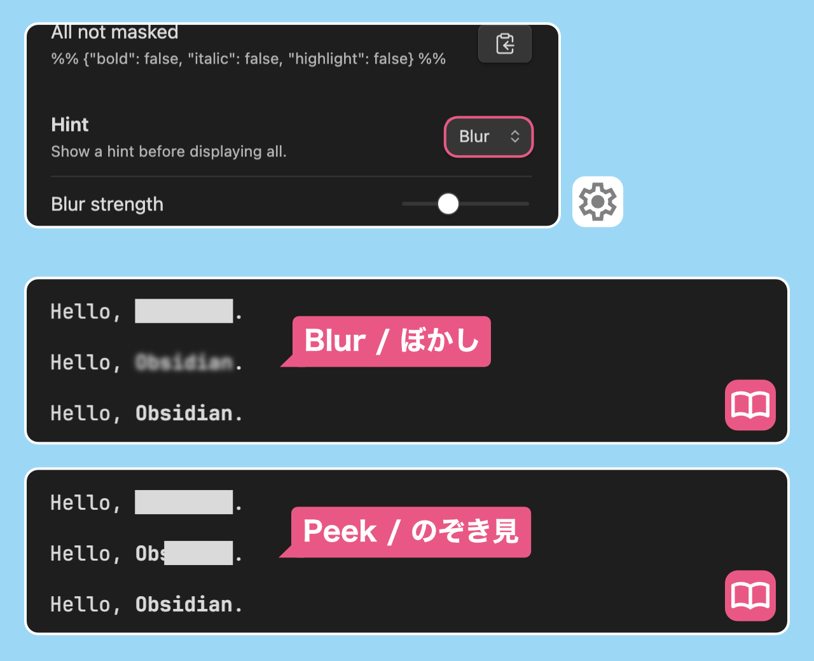

# About Plugin / プラグインについて

Add a feature to Obsidian that allows it to be used like a memorization sheet.

-   In reading mode, bold, italics, and highlights are filled in.
-   Click on the filled area to see the hidden text.

<!-- prettier-ignore-start -->
暗記シートのような使い方ができる機能をObsidianに追加します
<!-- prettier-ignore-end -->

-   閲覧モードにおいて、太字、斜体、ハイライトが塗りつぶされます
-   塗りつぶされた部分をクリックすると、隠されたテキストが表示されます

# How to use / 使用方法

## Hide text / テキストを隠す

Items that are turned on in the settings are filled in.

設定でオンにした項目が塗りつぶされます

## Set for each note / ノートごとに設定する

If you copy a comment from the settings and paste it at the beginning of the note, the settings for that comment take precedence.

設定からコメントをコピーし、ノートの先頭にペーストすることで、そのコメントの設定が優先されます

## Show hints / ヒントを表示する

By selecting the type of hint from the settings, a hint can be displayed before all text is displayed.

Hint type

-   Blur
-   Peek

設定からヒントの種類を選択することで、全体を表示する前にヒントを表示することができます

ヒントの種類

-   ぼかし
-   のぞき見

