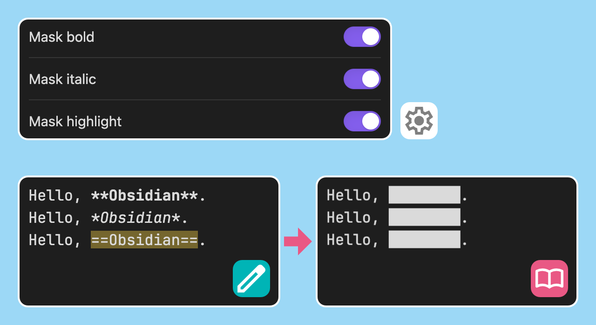
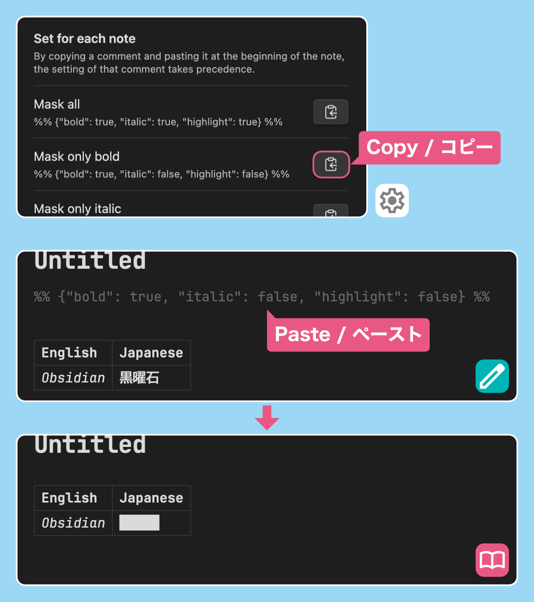
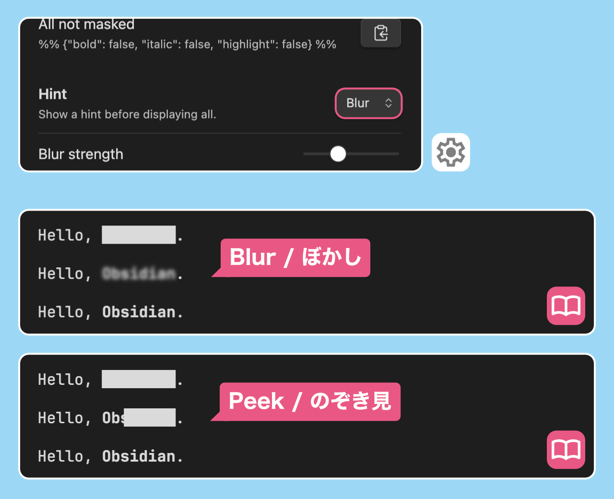
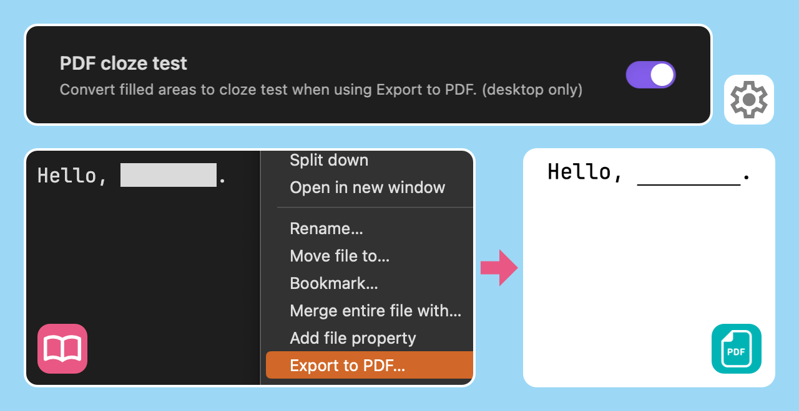

# Masking Type

## Features / 機能概要

This plugin adds the following features to Obsidian.

このプラグインはObsidianに以下の機能を追加します

- To aid memorization, hide text in bold, italics, and highlighted text.

- 太字、斜体、ハイライトされたテキストを隠し、暗記作業をサポートする

## Installation / インストール方法

Obsidian Settings > Community plugins > Browse > Type 'masking' into the search box > Select the 'Masking Type' card > Install > Enable

Obsidianの設定 > コミュニティプラグイン > 閲覧 > 検索ボックスに「masking」と入力 > 「Masking Type」のカードを選択 > インストール > 有効化

## Usage / 使い方

### Hide text / テキストを隠す

Items that are turned on in the settings are filled in.

設定でオンにした項目が塗りつぶされます

### Display text / テキストを表示

Click on the filled area.

塗りつぶされた部分をクリックしてください

### Set for each note / ノートごとに設定する

Copy the property from the settings and paste it into the beginning of the note.  
Next, check the item you want to hide.

設定からプロパティをコピーし、ノートの先頭にペーストします  
次に、隠したい項目にチェックを付けてください

### Show hints / ヒントを表示する

By selecting the type of hint from the settings, a hint can be displayed before all text is displayed.

設定からヒントの種類を選択することで、全体を表示する前にヒントを表示することができます

Hint type / ヒントの種類

- Blur / ぼかし
- Peek / のぞき見

### PDF cloze test / PDF の穴埋め化

Convert filled areas to cloze test when using Export to PDF. (version 1.1.0~, desktop only)

PDF にエクスポートを使用する際に、塗りつぶし箇所を穴埋め問題に変換します（バージョン 1.1.0~、デスクトップ専用）

